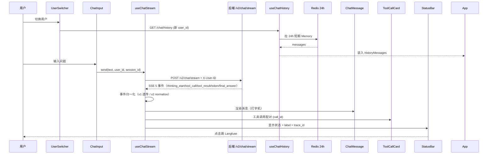
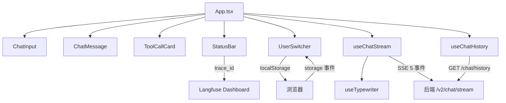

# SecOps Copilot - Web

> AI 安全运营研判助手 · 前端 · v2 SSE 流式 Chat UI（实时推理可视化 + 多用户记忆隔离）

[](https://react.dev/)
[](https://www.typescriptlang.org/)
[](https://vitejs.dev/)
[](LICENSE)

## 🎯 这是什么

SecOps Copilot 的前端 Web 应用。**实时推理可视化** + **多用户记忆隔离**——把后端 4 Agent 协同（Supervisor + RAG + Tool + Memory）的全过程**逐事件渲染**给用户。

## 🎬 效果预览


> 演示：v2 模式 4 Agent 协同推理 + 打字机逐字输出 + 工具卡片自动折叠 + 用户切换历史隔离

## ✨ 核心特性（v2）

### 1. **打字机效果**（useTypewriter hook，25ms/字，App.tsx 传参）
- LLM 流式回答**逐字渲染**——**不**等**完整**答案
- 用户能**看到** AI **在思考**——**降低**等待焦虑

### 2. **v1/v2 切换**（默认 v2）
- v1：`/chat/stream`（手写 ReAct + 4 tier 降级，**无记忆**）
- v2：`/v2/chat/stream`（4 Agent 协同 + 三层 Memory）
- 切换时**重置流状态 + 清消息**（避免跨版本状态污染）

### 3. **多用户隔离**（UserSwitcher + Redis 24h）
- 3 固定用户，用户切换**不串台**
- user_id **双保险**透传：`X-User-ID` header + `body.user_id`
- localStorage 存 user_id（**关页签不丢**） + sessionStorage 存 version
- 跨页签同步：`window.addEventListener("storage", ...)` 监听 user_id 变更
- 切用户 → 清 useChatStream 状态 + 清累积消息 + 重拉 Redis history

### 4. **状态 label 管道**（细化状态事件）
- 后端 SSE `thinking_start` 事件带 `label` 字段（"Supervisor 分派中" / "拆解子问题中" / "检索子问题 1/4: XX问题" / "整合 N 篇资料，生成答案中"）
- 前端 `useChatStream.setStatusLabel(label)` → App 透传 → `StatusBar` 显示
- 协议向后兼容（label 可选，老 SSE 不带 label 也能跑）

## 🏗️ 架构

### SSE 流式数据流（v2 4 Agent）



### 核心组件 + Hook 分层



## 📂 项目结构

```
secops-copilot-web/
├── public/                          # 静态资源
├── src/
│   ├── App.tsx                      # 根组件（v1/v2 切换 + 多用户隔离 + 状态 label 管道 + 累积消息）
│   ├── main.tsx                     # 入口
│   ├── components/
│   │   ├── ChatInput.tsx            # 输入框（disabled when thinking）
│   │   ├── ChatMessage.tsx          # 消息气泡（user / assistant）
│   │   ├── StatusBar.tsx            # 状态栏（status + label + error）
│   │   ├── ToolCallCard.tsx         # 工具调用卡片（折叠 + call_id 配对）
│   │   └── UserSwitcher.tsx         # 用户切换（3 固定用户 + localStorage）
│   ├── hooks/
│   │   ├── useChatStream.ts         # SSE 消费（fetch + ReadableStream + 事件归一化 + 状态 label）
│   │   ├── useChatHistory.ts        # 短期 Memory 拉取（Redis 24h）
│   │   └── useTypewriter.ts         # 打字机 hook（25ms/字）
│   └── types/
│       └── events.ts                # TypeScript 类型（ChatEvent / ChatStatus / ToolPair）
├── Dockerfile                       # Docker 化
├── vite.config.ts                   # Vite + 代理配置
├── tsconfig.json
└── package.json
```

## 🚀 快速开始

### 前置要求

- Node.js 20+
- [pnpm](https://pnpm.io/) / npm / yarn

### 安装

```bash
# 1. 克隆
git clone https://github.com/sec-8/secops-copilot-web.git
cd secops-copilot-web

# 2. 安装依赖
pnpm install
# 或 npm install / yarn install
```

### 启动开发模式

```bash
# 默认代理到 http://localhost:8000 (后端)
pnpm dev
# 或 npm run dev
```

访问 http://localhost:5173

### 构建生产版本

```bash
pnpm build
# 产物在 dist/
```

## 🔌 SSE 事件协议

### 5 个事件类型（v2）

| 事件 | 触发时机 | 字段 | 备注 |
|------|---------|------|------|
| `thinking_start` | Supervisor 分派 / 子问题拆分 / LLM 生成 | `iteration, label` | `label` 可选（状态细化）|
| `tool_call` | LLM / Supervisor 决定调用工具 | `name, args, call_id` | `call_id` 用于配对 |
| `tool_result` | 工具返回 | `name, result, call_id` | 配对到对应 tool_call |
| `token` | LLM 流式输出 | `content` | 累计到 `liveAnswer` |
| `final_answer` | 循环结束 | `content, citations, has_answer, trace_id, call_id` | 触发打字机追完 + 工具卡折 |

### 消费方式（fetch + ReadableStream）

```typescript
const response = await fetch(url, {
  method: 'POST',
  ...
})

const reader = response.body.getReader()
const decoder = new TextDecoder()

while (true) {
  const { done, value } = await reader.read()
  if (done) break
  const chunk = decoder.decode(value, { stream: true })
  // 解析 SSE 格式：data: {...}\n\n
}
```

## 🛠️ 技术栈

- **框架**：React 18 + TypeScript 5
- **构建**：Vite 5
- **样式**：Tailwind CSS
- **流式**：SSE（fetch + ReadableStream + 事件归一化）
- **状态**：React Hooks（useState / useEffect / useRef / useCallback）
- **持久化**：localStorage（user_id / session_id，**浏览器级**）+ sessionStorage（version）
- **部署**：Docker（多阶段构建）


## 📝 License

MIT

---

## 🤝 配套仓库

- **后端**：[secops-copilot](https://github.com/sec-8/secops-copilot)

## 📌 v1 → v2 升级要点

| 维度 | v1 | v2 |
|------|----|----|
| 端点 | `/chat/stream` | `/v2/chat/stream` |
| 协议 | 4 事件（thinking_start / tool_call / tool_result / final_answer）| 5 事件（+ `token` 流式逐字）|
| 字段归一化 | 透传 | normalize（v1 透传 / v2 normalize）|
| 状态 label | 默认文案 | `statusLabel` 管道（透传后端 `label`）|
| 记忆 | 无 | Redis 24h 短期 + `useChatHistory` 拉取 |
| 多用户 | 单用户 | `UserSwitcher` + `localStorage` + 跨页签 `storage` 事件 |
| 工具卡 | 手动折叠 | finalAnswer 到达时一次性自动折叠 |
| 历史回显 | 无 | `useChatHistory` 装入 `messages` |
