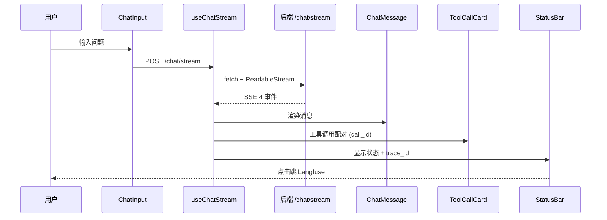
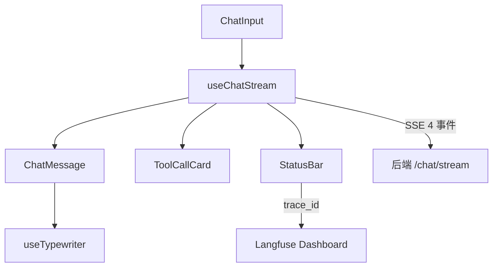

# SecOps Copilot - Web

> AI 安全运营研判助手 · 前端 · SSE 流式 Chat UI

[](https://react.dev/)
[](https://www.typescriptlang.org/)
[](https://vitejs.dev/)
[](LICENSE)

## 🎯 这是什么

SecOps Copilot 的前端 Web 应用。**流式渲染** AI 研判过程，把 4 个 SSE 事件（`thinking_start` / `tool_call` / `tool_result` / `final_answer`）**实时展示**给用户。

## ✨ 核心特性

### 1. **打字机效果**（useTypewriter）
- LLM 流式回答**逐字渲染**——**不**等**完整**答案
- 用户能**看到** AI **在思考**——**降低**等待焦虑

### 2. **工具调用卡片**（ToolCallCard）
- 工具名称 + 参数 + 结果**自动折叠**
- 多次工具调用**用 call_id 配对**
- 失败 / 异常**有**视觉提示

### 3. **状态栏 + 可观测**（StatusBar）
- 实时显示**当前状态**（思考中 / 工具调用中 / 等待输入 / 异常）
- **trace_id 链接**到 Langfuse Dashboard
- **不打断**用户阅读——长消息不强制滚到底

## 🏗️ 架构

### SSE 流式数据流



### 核心组件分层



**对应后端**：`POST /chat/stream` SSE **端点**（`app/main.py`）→ **返**回 4 **事**件**（`thinking_start` / `tool_call` / `tool_result` / `final_answer`）

## 📂 项目结构

```
secops-copilot-web/
├── public/                   # 静态资源
├── src/
│   ├── components/           # 4 组件（ChatInput / ChatMessage / StatusBar / ToolCallCard）
│   ├── hooks/                # 2 Hooks（useChatStream / useTypewriter）
│   ├── types/                # TypeScript 类型（events.ts）
│   ├── App.tsx               # 根组件
│   └── main.tsx              # 入口
├── Dockerfile                # Docker 化
├── vite.config.ts            # Vite + 代理配置
├── tsconfig.json
└── package.json
```

## 🚀 快速开始

### 前置要求

- Node.js 20+
- [pnpm](https://pnpm.io/) / npm / yarn

### 安装

```bash
# 1. 克隆
git clone https://github.com/sec-8/secops-copilot-web.git
cd secops-copilot-web

# 2. 安装依赖
pnpm install
# 或 npm install / yarn install
```

### 启动开发模式

```bash
# 默认代理到 http://localhost:8000 (后端)
pnpm dev
# 或 npm run dev
```

访问 http://localhost:5173

### 构建生产版本

```bash
pnpm build
# 产物在 dist/
```

## 🔌 SSE 事件协议

### 4 个事件类型

| 事件 | 触发时机 | 字段 |
|------|---------|------|
| `thinking_start` | ReAct 循环每轮开始 | `iteration, query` |
| `tool_call` | LLM 决定调用工具 | `name, args, call_id` |
| `tool_result` | 工具返回 | `name, result_preview, call_id` |
| `final_answer` | 循环结束 | `content, sources, trace_id` |

### 消费方式（fetch + ReadableStream）

```typescript
const response = await fetch('/chat/stream', {
  method: 'POST',
  headers: { 'Content-Type': 'application/json' },
  body: JSON.stringify({ query: '如何检测 DOM 型 XSS？' })
})

const reader = response.body.getReader()
const decoder = new TextDecoder()

while (true) {
  const { done, value } = await reader.read()
  if (done) break
  const chunk = decoder.decode(value)
  // 解析 SSE 格式：data: {...}\n\n
}
```

## 🎨 关键设计

### 1. **打字机效果**

```typescript
// useTypewriter: 逐字渲染
const [displayed, setDisplayed] = useState('')
useEffect(() => {
  if (displayed.length < fullText.length) {
    const timer = setTimeout(() => {
      setDisplayed(fullText.slice(0, displayed.length + 1))
    }, 30) // 30ms/字
    return () => clearTimeout(timer)
  }
}, [displayed, fullText])
```

### 2. **trace_id 链接**

```typescript
// final_answer 事件带 trace_id
<StatusBar trace_id={finalAnswer.trace_id} />
// 点击跳转到 Langfuse Dashboard
window.open(`https://cloud.langfuse.com/trace/${trace_id}`)
```

## 🛠️ 技术栈

- **框架**：React 18 + TypeScript 5
- **构建**：Vite 5
- **样式**：Tailwind CSS
- **流式**：SSE（fetch + ReadableStream）
- **部署**：Docker（多阶段构建）

## 📝 License

MIT

---

## 🤝 配套仓库

- **后端**：[secops-copilot](https://github.com/sec-8/secops-copilot)
- **演示 Demo**：（可现场演示）
